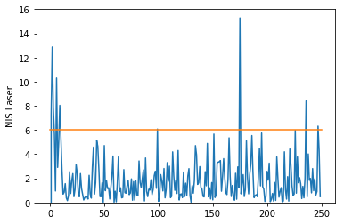

# Unscented Kalman Filter
Self-Driving Car Engineer Nanodegree Program

In this project utilize an Unscented Kalman Filter to estimate the state of a moving object of interest with noisy lidar and radar measurements. Passing the project requires obtaining RMSE values that are lower that the tolerance outlined in the project rubric. 

## Code

The code may be found in this repository. The source files that are new or modified are in the src folder and comprise the following:
1. main.cpp
2. ukf.cpp and ukf.h
3. KalmanFilterFactory.cpp and KalmanFilterFactory.h
4. KFEnums.h
5. SensorFusion.cpp, SensorFusion.h
6. StateVector.h
7. tools.cpp, tools.h

The other code source in src are unmodified.

### Rubric: Builds
1. The project code compiles and builds under Windows and Ubuntu OSes.


### Rubric: Accuracy
2. The final RMSE were [0.083, 0.083, 0.37, 0.15], which is below the threshold of [.09, 0.10, 0.40, 0.30] set in the rubric.


The estimated and ground truth is plotted below from the simulator:


### Rubric: Follows the general processing follow

#### Design
##### SensorFusion

The creation and initialization of the processing was encapsulated in the class SensorFusion. It contains the state vector, the KalmanFilterFactory class that is responsible for creating the appropriate Kalman filter based on the sensor and Kalman filter type. Currently, only the UKF types are supported. It can be expanded to accommodate EKF also.

In this project, the laser and rader UKF classes are created and stored in a map. The processing method takes the sensor type and applies the mapped Kalman filter's ProcessMeasurement method.

##### StateVector
The StateVector class carries the state vector and the covariance matrix.
It also contains the time of the last process measurement and a flag indicating if the state vector was initialized.

##### UKF
UKF is the base UKF class that contains most of the process algorithm and is designed to be specialized for the specific sensor type.

UKF
Contains the variables needed for process and declares and allocates some temporary work matrices so they don't need to be repeated.

The base class UKF has one main public method ProcessMeasurement that is responsible for processing the measurement data. Within UKF, there are the private methods Prediction and Update.
1. Prediction = generates the sigma points using augmentation to accomodate noise, projects the with the process model, and computes the mean and the covariance from the projected sigma points.
2. Update processes the measurement and makes a correction to the prediction based on the difference between the prediction and the measurement.

## Rubric: Initialization


### Initialize the state variable, x

There are three virtual methods that can be specialized by derived class for the specific sensor:
1. **InitializeMeasurement** - handles the first measurement, initializing the state vector based on the first measurment and sets up the subsequent process.

### Initializing P
When available the covariance matrix was initialized using the measurement uncertainy of the corresponding state variable. For the variables, x and y, we use the standard deviation of the lidar uncertainty in measuring the position x and y - 0.15 and 0.15.

For the velocity, the radar measured rho_dot directly and so we used the uncertainty of that degree of freedom, std_rhodot = 0.3.

For yaw and yawdot, I left that as a variable scale parameter named alpha which I varied to (1) meet the RMSE criteria and (2) to make the NIS consistent.
The final P initialization is listed below. 

$P =  \begin{bmatrix} 0.15^{2}& & & &\\ & 0.15^{2}  & & &\\ & & 0.3^{2} & & \\ & &  & 0.01& \\ & &  & & 0.01\\ \end{bmatrix}$

This was done in the the code in the file 'SensorFusion.cpp'
```
	// Initialize P_
	// Get uncertainty from laser of position coordinates
	UKFLaser* laserfs = dynamic_cast<UKFLaser*>(mapSensorsType2KF_[MeasurementPackage::LASER]);
	double stdx = laserfs->GetStdX();
	double stdy = laserfs->GetStdY();

	// Get uncertainty from radar of longitudinal velocity
	UKFRadar* radarfs = dynamic_cast<UKFRadar*>(mapSensorsType2KF_[MeasurementPackage::RADAR]);
	double stdv = radarfs->GetStd_rd();

	VectorXd pDiag(N_STATE_VECTOR_DIMENSION);
	pDiag << stdx * stdx, stdy*stdy, stdv*stdv, alpha, alpha;
	theState_.P_ = pDiag.asDiagonal();
```

## Rubric: ProcessMeasurement
- Predicts first and then updates.

### UKF
UKF::ProcessMeasurement followed the processing as outlined in the lessons. The code was based on code from the class lessons and were modified to be more efficient.
The class signatures were updated to use reference instead of pointers.

**Prediction(double dt )**
- AugmentSigmaPoints - generates the sigma points
- SigmaPointPrediction - applies the process model to the generated sigma points
- PredictMeanAndCovariance - computes the mean and convariance by using a weighted average of the sigma points and the covariance.

**Update( const MeasurementPackage &meas )**
- Convert predicted sigma points into measurement space
- Computes the innovation and cross correlation matrix. Normalizing the angles after taking the difference between the predicted sigma point and the mean is crucial in stability.
- Computes the NIS.

## Rubric: Appropriate handling for Lidar and Radar
Update is specialized of Lidar and Radar by overriding these virtual methods described in the section below.
- UKFRadar::Convert2MeasurementSpace

### UKF Laser
Member variables for Laser:

Constructor initialized the following:
1. n\_z\_ this is the number of dimensions in the laser measurement space, 2
2. The innovation and cross correlation matrices are allocated
3. Flag to process data or not.

InitializeMeasurement
1. Initialize the state vector with information from the first measurement

Convert2MeasurementSpace
Takes the predicted sigma points in state space into the measurement space. Here the conversion is simple since the laser measures the position only and the state vector contains the position.

NormalizeMeasurementAngles
Since there are no angles, it does nothing.


### UKF Radar
Member variables for Radar:

Constructor initialized the following:
1. n\_z\_ this is the number of dimensions in the radar measurement space, 3.

Methods overridden
Convert2MeasurementSpace
Takes the predicted sigma points in state space into the measurement space. For the radar measurement this requires transforming the state vector into the polar coordinates of the radar system.

NormalizeMeasurementAngles
Since the radar coordinates has an angle, we normalize that angle component.


### Code Efficiency Optimizations
1. Work/storage variables are declared and pre-allocated in the constructor to reduce repeated allocation to the stack.
2. The cross correlation and innovation matrices in the update state are computed in the same loop to reduce repeated calculations.
3. The same code is used for both sensor types.

### Tuning Parameters
The following parameters are used to tune the model, alpha, std_a, and std_yawdd.
Alpha is a factor used to intialize the convariance matrix P.

In addition to searching for the for parameters values to meet the RMSE criteria, the parameters values must be chosen so the Gaussian distribution parameters are consistent. To this end, we use the NIS which is related to the generalize distance, the square of the Malahobnis distrance. The parameters determine the size of the ellipse that define the distribution and must be selected so that 95% of....

For the final selected parameters, the NIS of the Laser and Radar data are displayed in the graphs below. These data show that the distances are 95% of the time below the expected 95% of the time. NIS is a statistic that follows the chisquare distribution with degrees of freedom 2 and 3 for the laser and radar data. 



